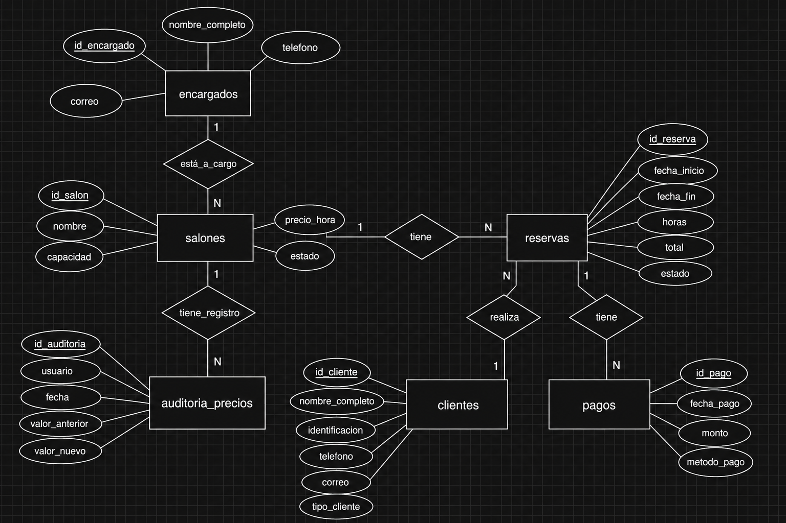
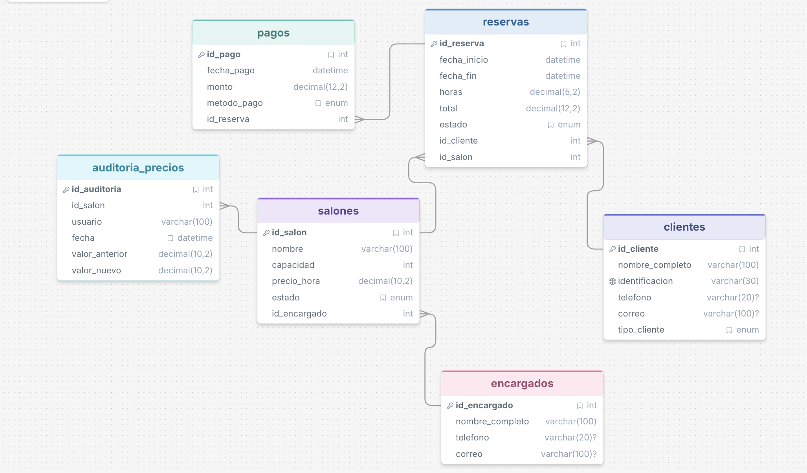
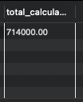
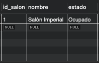
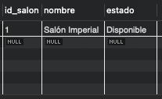
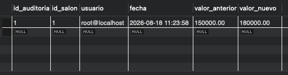
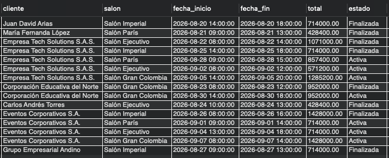
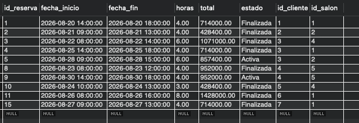
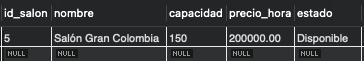
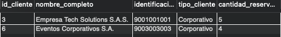

# Eventos Premier S.A.S. - Sistema de Reservas

## Descripción del proyecto

**Eventos Premier S.A.S.** es una empresa dedicada al alquiler de salones para reuniones, fiestas y conferencias.

El objetivo de este proyecto es diseñar e implementar una base de datos en **MySQL** que permita digitalizar la gestión de salones, clientes, reservas y pagos.

El sistema también permite controlar la disponibilidad de los salones, calcular automáticamente el valor de las reservas con IVA del 19 %, generar reportes mediante consultas y vistas, y registrar los cambios realizados en los precios de los salones mediante una tabla de auditoría.

---

## Objetivos

El sistema permite:

- Gestionar los salones disponibles para alquiler.
- Registrar la información de los clientes.
- Registrar y consultar reservas.
- Registrar los pagos asociados a las reservas.
- Calcular el valor total de una reserva incluyendo IVA.
- Verificar la disponibilidad de un salón.
- Actualizar automáticamente el estado de un salón al registrar o eliminar una reserva.
- Registrar los cambios de precio de los salones.
- Generar consultas y reportes para apoyar la administración.

---

## Tecnologías utilizadas

- **MySQL**
- **SQL**
- **MySQL Workbench**
- **Git**
- **GitHub**

---

## Base de datos

El nombre de la base de datos es:

```sql
CREATE DATABASE eventos_premier;
```

Para trabajar con ella:

```sql
USE eventos_premier;
```

---

## Estructura de la base de datos

El sistema está compuesto por seis tablas:

### 1. `encargados`

Registra la información de los responsables de los salones.

Campos principales:

- `id_encargado`
- `nombre_completo`
- `telefono`
- `correo`

### 2. `salones`

Registra la información de cada salón.

Campos principales:

- `id_salon`
- `nombre`
- `capacidad`
- `precio_hora`
- `estado`
- `id_encargado`

El estado de un salón puede ser:

- `Disponible`
- `En mantenimiento`
- `Ocupado`

### 3. `clientes`

Registra la información de los clientes.

Campos principales:

- `id_cliente`
- `nombre_completo`
- `identificacion`
- `telefono`
- `correo`
- `tipo_cliente`

Los tipos de cliente son:

- `Individual`
- `Corporativo`

### 4. `reservas`

Registra las reservas realizadas.

Campos principales:

- `id_reserva`
- `fecha_inicio`
- `fecha_fin`
- `horas`
- `total`
- `estado`
- `id_cliente`
- `id_salon`

### 5. `pagos`

Registra los pagos realizados para cada reserva.

Campos principales:

- `id_pago`
- `fecha_pago`
- `monto`
- `metodo_pago`
- `id_reserva`

Los métodos de pago utilizados son:

- `Efectivo`
- `Tarjeta`
- `Transferencia`

### 6. `auditoria_precios`

Registra los cambios realizados al precio por hora de los salones.

Campos principales:

- `id_auditoria`
- `id_salon`
- `usuario`
- `fecha`
- `valor_anterior`
- `valor_nuevo`

---

## Diagramas

### Diagrama entidad-relacion




### Diagrama modelo lógico



---

## Funciones

### `calcular_total_reserva`

Recibe el precio por hora y la cantidad de horas y devuelve el valor total de la reserva incluyendo el IVA del 19 %.

Ejemplo:

```sql
SELECT calcular_total_reserva(150000, 4) AS total;
```

Resultado esperado:

```text
714000.00
```

El cálculo es:

```text
150000 × 4 = 600000
600000 × 1.19 = 714000
```

### `verificar_disponibilidad`

Comprueba si un salón está disponible durante un rango de fecha y hora determinado.

Recibe:

- `salon_id`
- `fecha_inicio`
- `fecha_fin`

Retorna:

- `1` → disponible
- `0` → ocupado

Ejemplo:

```sql
SELECT verificar_disponibilidad(
    2,
    '2026-08-28 10:00:00',
    '2026-08-28 12:00:00'
) AS disponibilidad;
```

---

## Consultas SQL

### 1. Reservas en un rango de fechas

Esta consulta utiliza `BETWEEN` para obtener las reservas que comienzan dentro del rango indicado.

```sql
SELECT
    id_reserva,
    fecha_inicio,
    fecha_fin,
    horas,
    total,
    estado,
    id_cliente,
    id_salon
FROM reservas
WHERE fecha_inicio BETWEEN '2026-08-20 00:00:00'
                       AND '2026-08-31 23:59:59';
```

### 2. Salones con capacidad mayor a X y disponibles

La consulta combina la capacidad y el estado del salón.

```sql
SELECT
    id_salon,
    nombre,
    capacidad,
    precio_hora,
    estado
FROM salones
WHERE capacidad > 100
AND estado = 'Disponible';
```

### 3. Clientes corporativos con más de 3 reservas

Se utilizan `COUNT`, `GROUP BY` y `HAVING`.

```sql
SELECT
    c.id_cliente,
    c.nombre_completo,
    c.identificacion,
    c.tipo_cliente,
    COUNT(r.id_reserva) AS cantidad_reservas
FROM clientes AS c
LEFT JOIN reservas AS r
    ON c.id_cliente = r.id_cliente
WHERE c.tipo_cliente = 'Corporativo'
GROUP BY
    c.id_cliente,
    c.nombre_completo,
    c.identificacion,
    c.tipo_cliente
HAVING COUNT(r.id_reserva) > 3;
```

---

## Vista

### `vista_resumen_reservas`

La vista reúne información de las tablas `reservas`, `clientes` y `salones` para facilitar la consulta de los datos principales de cada reserva.

La vista muestra:

- Nombre del cliente
- Nombre del salón
- Fecha de inicio
- Fecha de fin
- Total
- Estado

Creación:

```sql
CREATE VIEW vista_resumen_reservas AS
SELECT
    c.nombre_completo AS cliente,
    s.nombre AS salon,
    r.fecha_inicio,
    r.fecha_fin,
    r.total,
    r.estado
FROM reservas AS r
INNER JOIN clientes AS c
    ON r.id_cliente = c.id_cliente
INNER JOIN salones AS s
    ON r.id_salon = s.id_salon;
```

Consulta:

```sql
SELECT *
FROM vista_resumen_reservas;
```

---

## Triggers

### `actualizar_estado_salon_trigger`

Se ejecuta después de insertar una nueva reserva.

Su función es cambiar automáticamente el estado del salón reservado a `Ocupado`.

Flujo:

```text
INSERT en reservas
       ↓
Trigger
       ↓
Salón = "Ocupado"
```

### `liberar_salon_trigger`

Se ejecuta después de eliminar una reserva.

Su función es cambiar nuevamente el salón a `Disponible`.

Flujo:

```text
DELETE en reservas
       ↓
Trigger
       ↓
Salón = "Disponible"
```

### `auditoria_precios_trigger`

Se ejecuta después de actualizar un salón.

Cuando cambia `precio_hora`, el trigger registra automáticamente en `auditoria_precios`:

- Salón afectado
- Usuario que realizó el cambio
- Fecha y hora
- Valor anterior
- Valor nuevo

Para identificar el cambio se utilizan:

- `OLD.precio_hora`
- `NEW.precio_hora`

---

## Pruebas y evidencias

Las pruebas realizadas se encuentran en la carpeta `images/`.

### 1. Pruebas de funciones

#### Prueba 1.1 - `calcular_total_reserva`

Evidencia de la ejecución de la función de cálculo del total con IVA.



#### Prueba 1.2 - `verificar_disponibilidad`

Evidencia de la ejecución de la función que verifica la disponibilidad del salón.


---

### 2. Pruebas de triggers

#### Prueba 2.1 - Actualización del estado del salón

Evidencia del trigger que cambia el salón a `Ocupado` al registrar una reserva.



#### Prueba 2.2 - Liberación del salón

Evidencia del trigger que cambia el salón a `Disponible` al eliminar una reserva.



#### Prueba 2.3 - Auditoría de precios

Evidencia del trigger que registra los cambios del precio por hora en `auditoria_precios`.



---

### 3. Prueba de la vista

#### Prueba 3 - `vista_resumen_reservas`

Evidencia de la consulta de la vista con la información resumida de las reservas.



---

### 4. Pruebas de consultas

#### Prueba 4.1 - Reservas en un rango de fechas

Evidencia de la consulta que utiliza `BETWEEN`.



#### Prueba 4.2 - Capacidad y estado

Evidencia de la consulta que obtiene salones con capacidad mayor a un valor determinado y estado `Disponible`.



#### Prueba 4.3 - Clientes corporativos

Evidencia de la consulta que obtiene clientes corporativos con más de 3 reservas.



---

## Instrucciones de ejecución

Para ejecutar el proyecto correctamente, se recomienda seguir este orden:

### 1. Crear la base de datos y las tablas

Ejecutar el script que contiene:

```sql
CREATE DATABASE
CREATE TABLE
```

y las llaves primarias y foráneas correspondientes.

### 2. Insertar los datos

Ejecutar el script que contiene los `INSERT INTO` para cargar los datos iniciales de:

- Encargados
- Salones
- Clientes
- Reservas
- Pagos

La tabla `auditoria_precios` no necesita datos iniciales, ya que será llenada automáticamente por el trigger de auditoría.

### 3. Crear las funciones

Ejecutar el script de funciones:

- `calcular_total_reserva`
- `verificar_disponibilidad`

### 4. Crear la vista

Ejecutar el script que crea:

- `vista_resumen_reservas`

### 5. Crear los triggers

Ejecutar el script que crea:

- `actualizar_estado_salon_trigger`
- `liberar_salon_trigger`
- `auditoria_precios_trigger`

### 6. Ejecutar las pruebas

Finalmente, ejecutar el script de pruebas para comprobar que las funciones, triggers, vista y consultas funcionan correctamente.

---

## Organización del proyecto

Una posible organización del repositorio es:

```text
eventos-premier/
│
├── README.md
│
├── sql/
│   ├── 01_base_datos.sql
│   ├── 02_funciones.sql
│   ├── 03_view.sql
│   ├── 04_consultas.sql
│   ├── 05_triggers.sql
│   └── 06_pruebas.sql
│
└── images/
    ├── prueba_1_1.png
    ├── prueba_1_2.png
    ├── prueba_2_1.png
    ├── prueba_2_2.png
    ├── prueba_2_3.png
    ├── prueba_3.png
    ├── prueba_4_1.png
    ├── prueba_4_2.png
    └── prueba_4_3.png
```

---

## Requisitos cumplidos

- [x] Creación de la base de datos.
- [x] Creación de 6 tablas.
- [x] Llaves primarias y foráneas.
- [x] Inserción de datos de prueba.
- [x] Función `calcular_total_reserva`.
- [x] Función `verificar_disponibilidad`.
- [x] Consulta con `BETWEEN`.
- [x] Consulta de capacidad y estado.
- [x] Consulta de clientes corporativos con más de 3 reservas.
- [x] Vista `vista_resumen_reservas`.
- [x] Trigger de actualización del estado del salón.
- [x] Trigger de liberación del salón.
- [x] Trigger de auditoría de precios.
- [x] Pruebas de funciones.
- [x] Pruebas de triggers.
- [x] Prueba de la vista.
- [x] Pruebas de consultas.
- [x] Evidencias de ejecución mediante capturas de pantalla.

---

## Créditos y autor

**Autor:** Juan David Arias Patiño

Proyecto académico de bases de datos desarrollado con MySQL.

---

## Créditos

Proyecto desarrollado con fines académicos para demostrar el uso de:

- Bases de datos relacionales
- SQL
- Funciones almacenadas
- Vistas
- Triggers
- Consultas y agregaciones
- Auditoría de cambios
